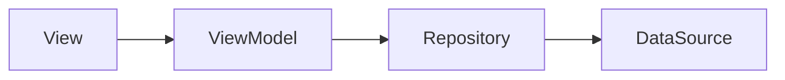

# MVVM 패턴

## 리뷰
- 안드로이드에서 regular expresstion(정규표현식)을 따로 정해뒀음
    - android.util.Patterns.EMAIL_ADDRESS.matcher(email).matches()

- 하드코딩으로 문자열을 쓰고있지만, 국제화가 어려움(다른 언어 지원)
    - values에 strings.xml에서 관리하면 언어 설정에 따라서 알아서 설정됨

- 요소들이 많아서 스크롤 길게 필요하면 lazy column 사용
    - 일반적인 UI인데 혹시 짤릴 위험이 있으면 Column에서 scroll 사용

- debounce vs throttle
    - debounce: 일정시간 무시 후 가장 마지막 것 선택 (검색) — view 단에서 사용
    - throttle: 선택 후 일정 시간 무시 함 (연타 방지, 이벤트)

- repository가 flow를 리턴하는 것의 문제가 레거시랑 섞여있을 경우가 있어서…

  asLiveData로 처리하면 될 것이다


- flow는 데이터 스트림으로 보면 됨

  데이터가 계속 변경되는 것을 관찰하는 형태

    - UI 업데이트를 까먹어도 문제 없게 — 반응형 == RX (ReactiveX)
    - composable이 알아서 구독하도록…
      레거시로 하면 구독 처리(라이프사이클 고려해서 collect하기) 해줘야 함

- RX에서 표준으로 많은 언어를 지원함… 연산자 검색
    - 마블 다이어그램
    - https://reactivex.io/documentation/operators/filter.html
---
# MVVM 패턴

> 앱의 확장성과 유지보수성을 위해서  
아키택처(프로젝트 전체 구조에 대한 패턴)를 사용하면 좋음


### 아키택처 디자인 패턴

- 유행에 따라서 쓰면 됨
    - MVC
    - MVC2
    - MVP
    - MVVM
    - MVI

## MVVM 패턴

> **Model-View-ViewModel**


- ms가 만든 개념
    - 안드로이드에서는 App(Android) Architecture Component라는 이름 사용
    - 구글은 MVVM 패턴이라는 걸 인정하지 않음

### ViewModel이란?

> UI 관련 비즈니스 로직을 처리하는 클래스
모든 UI의 상태는 ViewModel이 가진다
>



- ViewModel 클래스
    - **특정 화면**에서 필요한 데이터를 다시 정리하여 View에 전달하는 역할
    - 내일 디자인이 바뀌어도 Repository를 변경할 필요가 없어야 한다

      (ViewModel은 특정 화면, Repository를 여러 화면)


### ViewModel의 역할

> 데이터 받아와서 View에 뿌려줌
ViewModel은 단지 화면(View) 하나에 대한 로직(Model)일 뿐 ➡️ View 하나당 ViewModel 하나 (1:1)
>

> 🥝 Model(일반적으로는 Repository)에서 제공한 데이터를
UI로 표시하기 쉬운 형태로 변환해주는 역할 (복잡한 로직을 숨겨주는 == **캡슐화**)
>

1. 화면의 상태(변수)를 캡슐화
    - 화면에 표시할 데이터
    - 여러가지 상태 (로딩 등)
2. View에서 발생하는 액션(이벤트) 처리의 캡슐화

- 컴포넌트는 remember 사용 (state를 가짐)
    - 컴포턴트의 상태까지 ViewModel이 가지면 너무 복잡해서?
- 화면(screen)은 remember 안가지고 ViewModel이 가지도록

### 앱 상태 관리

> 상태에 따라서 UI가 바뀐다


## 안드로이드에서의 ViewModel

```kotlin
import androidx.lifecycle.ViewModel
import kotlinx.coroutines.flow.MutableStateFlow
import kotlinx.coroutines.flow.asStateFlow

class CounterViewModel : ViewModel() {
    // 일종의 패턴임
    private var _count = MutableStateFlow(0)
    val count = _count.asStateFlow()
		
    // 비즈니스 로직을 캡슐화
    fun increment() {
        _count.value++
    }
}
```

- `ViewModel` 을 상속받아서 구현 — Activity 생명 주기에 영향을 받지 않음
- `StateFlow` — 데이터 바인딩 구현의 핵심
    - Hot Stream
    - 값이 변하면 알아서 값을 방출함(emit) — UI에서 반영함

### ViewModel 인스턴스를 얻는 방법

> (ViewModel을) 화면에서 어떻게 쓰냐?
>

1. **레거시 대응** (Compose 밖)

```kotlin
class MainActivity : ComponentActivity() {
		override fun onCreate(savedInstanceState: Bundle?) {
				super.onCreate(savedInstanceState)
				
				val viewModel : CounterViewModel by viewModels()
```

```kotlin
// Java 방식 코트
val viewModel = ViewModelProvider(this)[CounterViewModel::class.java]
```

1. **Compose 전용** (Compose 안)

```kotlin
val viewModel: MainViewModel = viewModel()
```

- 의존성 추가하면 Compose 안에서(setContent 블록 내부) 사용가능

### Screen에 ViewModel 직접 주입

- 컴포즈로 간단하게 화면에 대한 ViewModel를 지정하려면, 디폴트값 주면 편하다
    - 기본적으로는 밖에서 만들어서 파라미터로 전달해줌

### Android가 제공하는 ViewModel의 생명주기
- 생명주기를 고려하여 UI 관련 데이터를 관리하도록 설계된 클래스
- 화면 회전이나 환경 변경시에서 데이터를 유지할 수 있다
- ViewModel의 생명주기는 Activity의 일생과 함께 한다

  (ViewModel과 연결된 activity가 제거될 때 자동으로 파괴됨)

    - 화면 회전으로는 파괴되지 않음
    - activity가 완전히 종료될 때까지 유지되므로 UI 관련 데이터 보존에 적합

## ✨ ViewModel에 의존성 주입 방법

> ViewModel 생성하는 규칙에 맞춰서 ViewModelFactory를 만들어 사용해야 한다  
규칙 자주 바뀌니 문서 확인 필요  
[Create ViewModels with dependencies  |  App architecture  |  Android Developers](https://developer.android.com/topic/libraries/architecture/viewmodel/viewmodel-factories?_gl=1*1ppimsi*_up*MQ..*_ga*MTIwMDE3NzE5Ny4xNzM2MzI1MjQy*_ga_6HH9YJMN9M*MTczNjMyNTI0Mi4xLjAuMTczNjMyNTI0Mi4wLjAuMjAxNzAwOTYwOA)

- statableRemember쓰면 되는거 아니냐?
    - 변수(상태)뿐만 아니라 비즈니스 로직까지 가지고 있어야해서 ViewModel이 필요함

- SOLID 원칙에 맞게 인터페이스로 줘야 함
    - 책임을 하나만 가지자.
    - 다른 객체를 가지지 말자. 특정 객체에 의존하지 말자

### Android의 어디에서 의존성 주입하는게 좋을까?

- activity는 부적절
    - 생명 주기가 복잡하고 수시로 새로 생성되기 때문

- **application에서 의존성 주입을 하자!** (의존성 생성, 조립하는 부분은 Application에서 하자)
    - 앱 전체를 통틀어서 하나만 존재함 —  `AndroidManifest.xml` 에서 재정의 가능
    - 앱이 종료될 때까지 살아있음

### Application 재정의

1. `Application` 상속 받아서 만들고
2. `AndroidManifest.xml` 에서 `name` 값을 재정의